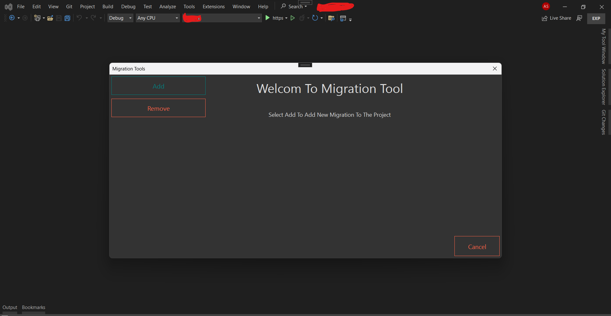
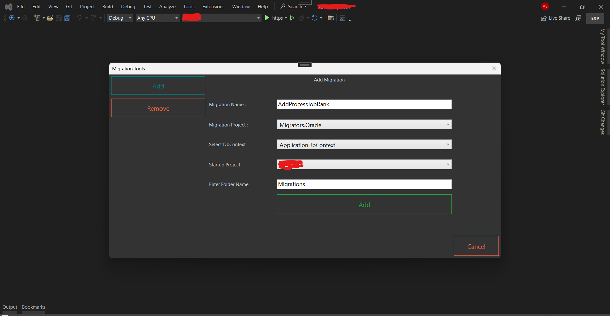
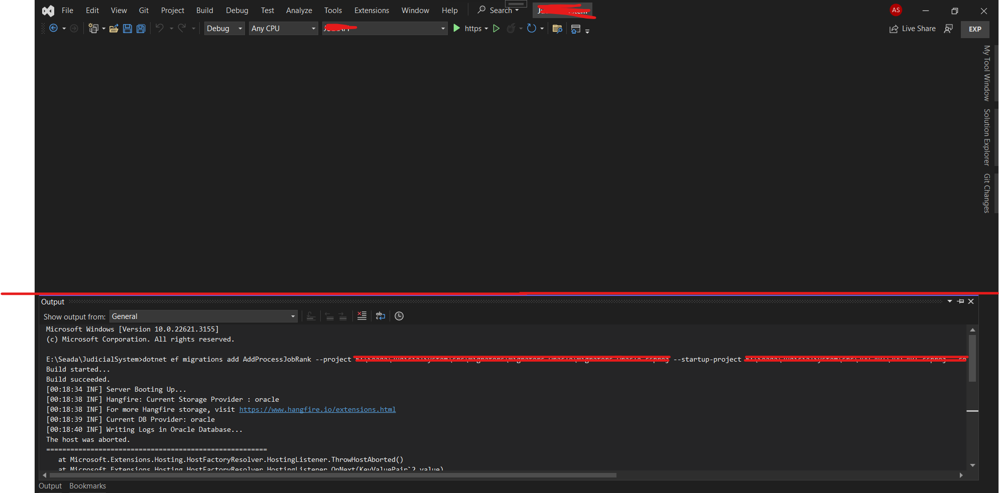
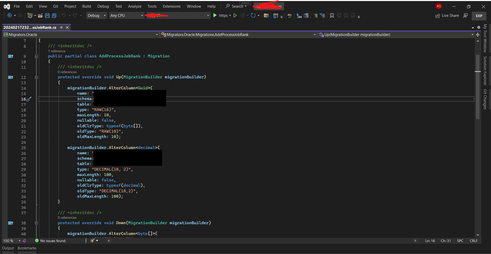

<p align="center">
  <a href="" rel="noopener">
 </a>
</p>

<h3 align="center">Migrations Tools </h3>

<div align="center">

[]()
[](/LICENSE)

</div>

---

<p align="center"> Migration Tools For Visual Studio
    <br> 
</p>

## 📝 Table of Contents

- [About](#about)
- [Getting Started](#getting_started)
- [Built Using](#built_using)
- [Authors](#authors)
- [Acknowledgments](#acknowledgement)

## 🧐 About <a name = "about"></a>

Migration Tools For Visual Studio Inspired By JetBrains Rider Ef Core Tools

#### Index Screen
<p align="center">
  <a href="" rel="noopener">
 </a>
</p>

## 

##### Fill In The Required Data Like The Name The Select The Migration Project
##### This Will Search For The DbContexts If Found It Will Populate The Context List Else You Have To Enter The DbContext Name

<p align="center">
  <a href="" rel="noopener">
 </a>
</p>

## 

##### After You Click The Add Button The Output Window Will Open To Preview The Adding Migration Process And Show If Any Something Went Wrong

<p align="center">
  <a href="" rel="noopener">
 </a>
</p>

## 

##### In The Selected Migration Project You Will Find The Newly Add Migration 

<p align="center">
  <a href="" rel="noopener">
 </a>
</p>


##  
#  Enjoy 😊😊

## 🏁 Getting Started <a name = "getting_started"></a>

These instructions will get you a copy of the project up and running on your local machine for development and testing purposes. 

### Prerequisites

you need to install dotnet-ef tools before you can use it 

```
dotnet tool install dotnet-ef --global
```

### Installing

Just Clone The Project And Build It


```
install the vsix file out of the bin folder
```


## 🔧 Running the tests <a name = "tests"></a>

After The Installation Open Visual Studio 

### 

In Visual Studio Menu Bar 

```
Tools > Migration Tools
```


## ⛏️ Built Using <a name = "built_using"></a>

- [C#](https://github.com/microsoft/dotnet) - dotnet c#


## ✍️ Authors <a name = "authors"></a>

- [@ahmedseada](https://github.com/ahmedseada) - Idea & Initial work


## 🎉 Acknowledgements <a name = "acknowledgement"></a>

- Hats Of For [@Mads Kristensen](https://www.youtube.com/watch?v=u0pRDM8qW04) For Simple Explanation And VS Extensibility ToolKit
- Inspired By [@jetbarins](https://github.com/jetbrains) Rider Ef Core Tools
